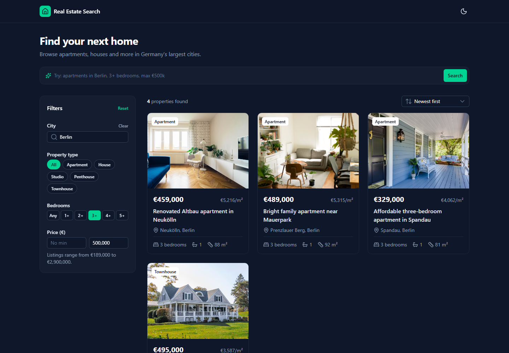
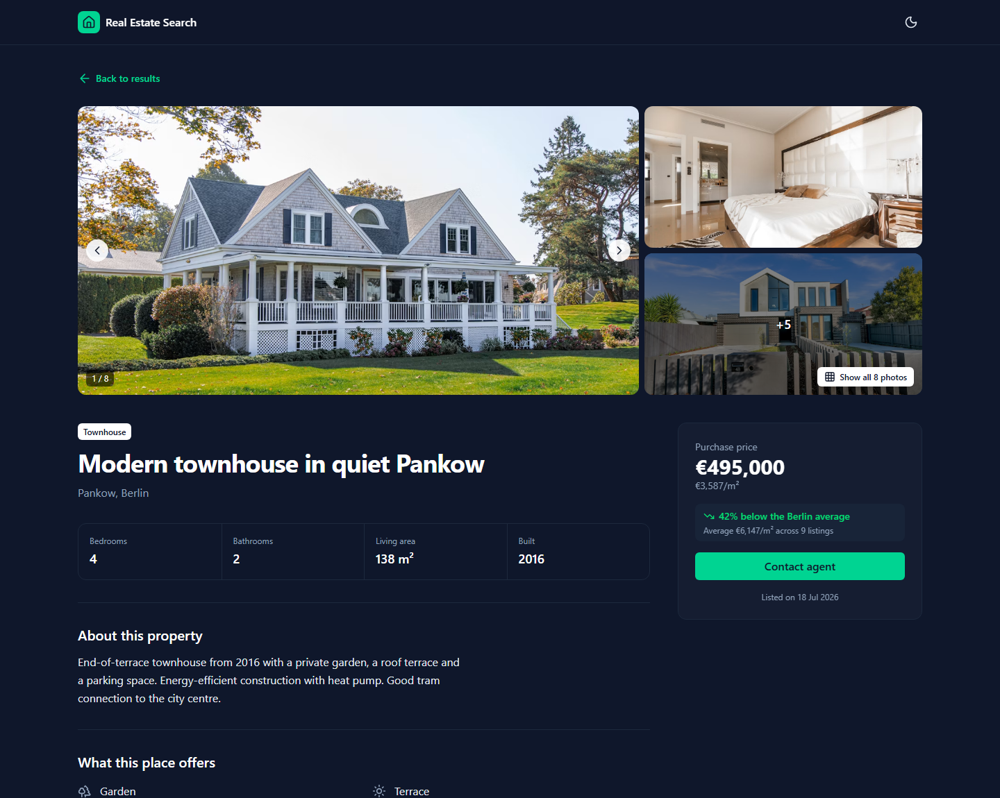
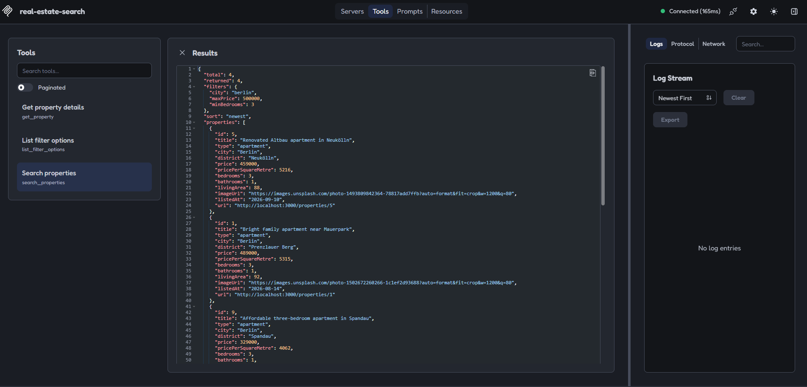

# Real Estate Search Assistant

A small app to search real estate listings, with a **Nuxt 3** frontend, a **Symfony 7.4** REST API
and an **MCP server**. All three run the same search code, so the challenge example returns the
same 4 properties everywhere:

> *"Properties in Berlin with at least 3 bedrooms and a maximum price of €500,000"*
>
> - **UI:** http://localhost:3000/?city=Berlin&minBedrooms=3&maxPrice=500000 (or type the sentence in the search bar)
> - **API:** `GET /api/properties?city=Berlin&minBedrooms=3&maxPrice=500000`
> - **MCP:** `search_properties({ "city": "Berlin", "minBedrooms": 3, "maxPrice": 500000 })`




## Getting started

Requires Docker.

```bash
docker compose up --build
```

| | URL |
|---|---|
| Frontend | http://localhost:3000 |
| REST API | http://localhost:8000/api/properties |
| MCP server | http://localhost:8000/mcp |

On first start the backend creates the SQLite database and imports the dataset (27 properties).

```bash
# Tests
docker compose exec backend composer test   # API, MCP tools, API/MCP parity
cd frontend && npm ci && npm test           # utilities and components
```

<details>
<summary>Without Docker (PHP 8.4, Composer, Node 22)</summary>

```bash
cd backend && composer install
php bin/console doctrine:migrations:migrate -n && php bin/console app:properties:import
php -S localhost:8000 -t public     # API on :8000, MCP over HTTP at /mcp
php bin/console mcp:server          # MCP over stdio

cd frontend && npm install && npm run dev
```
</details>

## MCP server

| Tool | What it does |
|---|---|
| `search_properties` | Search with optional `city`, `minPrice`, `maxPrice`, `minBedrooms`, `type`, `sort`, `limit` |
| `get_property` | Full details of one property, including its price per m² compared with the city average |
| `list_filter_options` | Valid cities and types, price range and sort options |
| `get_market_overview` | Price statistics per city (average €/m², price range), optionally for one type |

Connect a client while the backend is running:

```bash
# Claude Code
claude mcp add --transport http real-estate http://localhost:8000/mcp

# MCP Inspector: Add Servers → Add manually → streamable-http → http://localhost:8000/mcp
npx @modelcontextprotocol/inspector@latest
# (Windows "listen EACCES"? prefix with CLIENT_PORT=7274 SERVER_PORT=7277)

# stdio clients (e.g. Claude Desktop) use this command:
docker compose exec -T backend php bin/console mcp:server
```



## Architecture

```
Nuxt (SSR) ── /api proxy ──▶ ┌──────────────── Symfony ────────────────┐ ◀── MCP clients
                             │  PropertyController      MCP tools      │     (/mcp or stdio)
                             │          └──── PropertyCatalog ───┘      │
                             │                PropertyRepository ──────┼──▶ SQLite
                             └─────────────────────────────────────────┘
```

The REST controller and the MCP tools are thin adapters over one application service
(`PropertyCatalog`) and one validated search object (`PropertySearchCriteria`). The browser only
talks to the Nuxt server, which proxies `/api` to Symfony.

## Key decisions

- **MCP inside the backend, on the application layer.** Reading the database directly would
  duplicate the search logic; calling the REST API would add a second process and a network hop.
  Sharing `PropertyCatalog` means the UI and `search_properties` cannot diverge, and a test asserts
  they return the same results. Trade-off: the MCP server is deployed with the backend.
- **SQLite seeded from JSON.** The data is easy to review and the filters run as real SQL through
  Doctrine; moving to PostgreSQL only needs a different `DATABASE_URL`.
- **Explicit API contract.** Plain Symfony controllers with a validated DTO; every error is an
  RFC 9457 problem document (422 with per-field violations, 404 for unknown properties).
- **Tools designed for the model.** Same argument names as the API, an `outputSchema` on every tool,
  business errors returned as `isError` so the model can correct itself, and `get_market_overview`
  for questions the listing endpoints cannot answer ("Which city is cheapest per m²?").
- **The URL is the search state.** Shareable links, a working back button and server-side rendering
  of the same results; loading, error and empty states are all handled.
- **Rule-based quick search, not an LLM.** It turns "apartments in Berlin, 3+ bedrooms, max €500k"
  into filters offline and is unit-tested; understanding free text is what the MCP server is for.

More detail on each decision: [docs/decisions.md](docs/decisions.md).

## Next steps

- Location search via geocoding (districts, postcodes, "München" / "Munich")
- OpenAPI description with generated frontend types
- End-to-end tests and CI
- OAuth on the MCP endpoint before exposing it publicly
